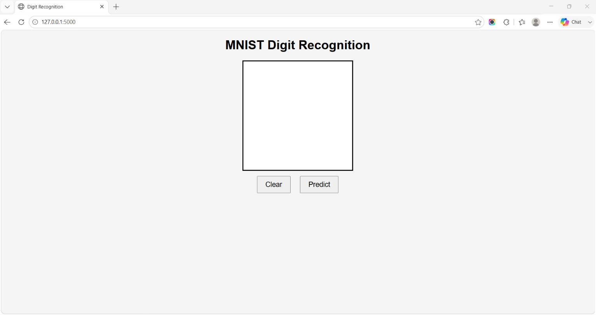
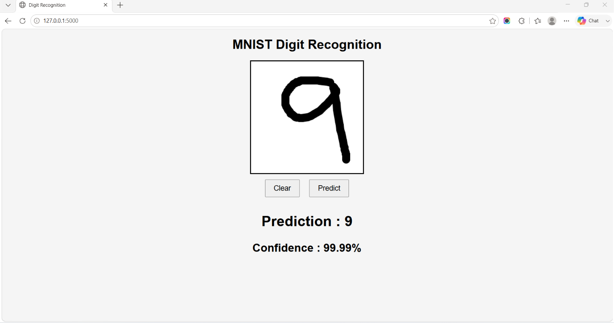

# 🧠 MNIST Handwritten Digit Recognition using CNN

A web application that recognizes handwritten digits (0–9) using a Convolutional Neural Network (CNN) built with TensorFlow/Keras and deployed with Flask.

---

## 📌 Features

- ✍️ Draw handwritten digits using the mouse
- 🤖 CNN predicts the digit
- 📊 Displays prediction confidence
- 🌐 Flask web application
- 🎨 Interactive HTML5 Canvas
- ⚡ TensorFlow/Keras Deep Learning Model

---

## 🛠 Technologies Used

- Python 3
- TensorFlow / Keras
- Flask
- OpenCV
- NumPy
- Pillow
- HTML
- CSS
- JavaScript

---

## 📂 Project Structure

```text
MNIST_AI/
│
├── app.py
├── train.py
├── utils.py
├── mnist_cnn.keras
├── requirements.txt
├── README.md
│
├── templates/
│      └── index.html
│
├── static/
│      ├── style.css
│      └── script.js
```

---

## 🚀 Installation

Clone the repository:

```bash
git clone https://github.com/sreejit/mnist-digit-recognition.git
```

Go to the project folder:

```bash
cd mnist-digit-recognition
```

Install dependencies:

```bash
pip install -r requirements.txt
```

Run the application:

```bash
python app.py
```

Open your browser:

```
http://127.0.0.1:5000
```

---

## 🧠 CNN Architecture

```
Input (28×28×1)

↓

Conv2D (32 Filters)

↓

MaxPooling

↓

Conv2D (64 Filters)

↓

MaxPooling

↓

Flatten

↓

Dense (256)

↓

Dropout (0.5)

↓

Dense (10)

↓

Prediction
```

---

## 📊 Model Performance

- Training Dataset: MNIST
- Test Accuracy: **99.19%**
- Framework: TensorFlow 2.20
- Optimizer: Adam
- Loss Function: Sparse Categorical Crossentropy

---

## 📷 Screenshots

### Home Page



### Prediction



### Home Page

_Add a screenshot here._

### Prediction Example

_Add a screenshot here._

---

## 🔮 Future Improvements

- Improve preprocessing for handwritten input
- Deploy the application on Render
- Add top-3 prediction probabilities
- Improve UI using Bootstrap
- Support mobile devices

---

## 👨‍💻 Author

**Sreejit**

Ph.D. Research Scholar

Research Area:

**AI and IoT Integrated Techniques for the Detection and Prediction of Brain Diseases with a Special Focus on Epilepsy**

---

## 📄 License

This project is licensed under the MIT License.